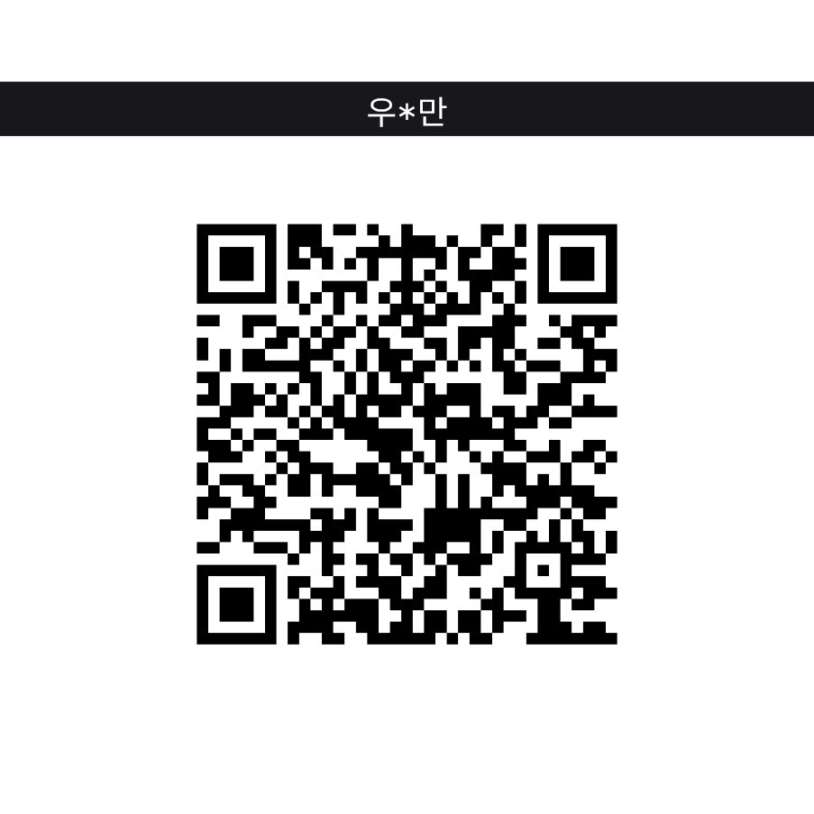

# 🇰🇷 KR Component Kit

> 대한민국에서만 사용할 수 있는 Home Assistant 통합 구성요소

[![hacs][hacsbadge]][hacs]
[![GitHub Release][releases-shield]][releases]
[![GitHub Activity][commits-shield]][commits]
[![License][license-shield]](LICENSE)

한국전력, 아리수, 안전알림서비스 등 대한민국에서만 사용할 수 있는 다양한 서비스를 Home Assistant에서 모니터링할 수 있게 해주는 통합 구성요소입니다.

---

## 📋 지원 서비스

### ⚡ 한국전력공사 (KEPCO)
- **전력 사용량** 실시간 모니터링
- **전기요금** 예상 및 지난달 요금 조회
- **누진단계** 및 사용량 통계

### 💧 아리수 (서울시 상수도)
- **수도요금** 조회
- **사용량** 정보 확인
- **고객번호** 기반 인증

### 🚨 안전알림서비스 (행정안전부)
- **재난문자** 실시간 수신
- **지역별** 안전알림 필터링
- **시도 / 시군구 / 읍면동** 단위 설정 가능

### 🚛 굿스플로우 (택배조회)
- **택배 배송현황** 통합 조회
- **여러 택배사** 지원
- **실시간 배송 추적**

### 🏠 가스앱 (도시가스)
- **가스 사용량** 모니터링
- **가스요금** 정보 조회
- **계약번호** 기반 인증

### 🗺️ 카카오맵 (길찾기)
- **실시간 교통정보** 기반 소요시간
- **출발지 → 목적지** 경로 정보
- **WGS84 / WCONGNAMUL** 좌표계 지원

---

## 🚀 설치 방법

### HACS를 통한 설치 (권장)

1. **HACS** 메뉴로 이동
2. **통합 구성요소** 선택
3. 우측 상단 **⋮** 메뉴 → **사용자 지정 리포지토리**
4. 다음 정보 입력:
   - **리포지토리**: `redchupa/kr_component_kit`
   - **카테고리**: `Integration`
5. **KR Component Kit** 검색 후 설치
6. **Home Assistant 재시작**

### 수동 설치

1. 이 리포지토리를 다운로드
2. `custom_components/kr_component_kit` 폴더를 Home Assistant의 `custom_components` 디렉토리에 복사
3. Home Assistant 재시작

---

## ⚙️ 설정 방법

**설정** → **기기 및 서비스** → **통합 구성요소 추가** → **"KR Component Kit"** 검색

### ⚡ 한국전력공사 (KEPCO)
- **사용자 ID**: 한전 홈페이지 로그인 ID
- **비밀번호**: 한전 홈페이지 로그인 비밀번호

### 💧 아리수 (서울시 상수도)
- **고객번호**: 수도요금 고지서의 고객번호
- **고객명**: 계약자 성명

### 🚨 안전알림서비스
- **시도**: 거주 지역의 시/도 선택
- **시군구**: 거주 지역의 시/군/구 선택 (선택사항)
- **읍면동**: 거주 지역의 읍/면/동 선택 (선택사항)

### 🚛 굿스플로우 (택배조회)
- **API 토큰**: 굿스플로우 API 키

### 🏠 가스앱
- **토큰**: 가스앱 인증 토큰
- **회원 ID**: 가스앱 회원 ID
- **사용계약번호**: 가스 사용계약번호

### 🗺️ 카카오맵
- **경로명**: 식별을 위한 경로 이름 (예: "집↔회사")
- **좌표계**: WGS84 또는 WCONGNAMUL 선택
- **출발지 / 도착지 좌표**: X(경도), Y(위도)

---

## 🔄 업데이트 주기

| 서비스 | 업데이트 주기 | 비고 |
|--------|-------------|------|
| 한전 (KEPCO) | 5분 | 로그인 세션 관리 |
| 아리수 | 30분 | 요금 정보 중심 |
| 안전알림 | 5분 | 실시간 알림 |
| 굿스플로우 | 15분 | 배송 상태 추적 |
| 가스앱 | 1시간 | 사용량 정보 |
| 카카오맵 | 1분 | 실시간 교통정보 |

---

## 📋 요구사항

- **Home Assistant** 2023.1.0 이상
- **Python** 3.11 이상
- **인터넷 연결** (각 서비스 API 접근)

---

## 🐛 문제 해결

### 로그인 실패
- 웹사이트에서 직접 로그인이 되는지 확인
- 2차 인증(OTP) 설정된 계정은 지원하지 않음

### 안전알림 지역 목록이 표시되지 않을 때
- 네트워크 연결 상태 점검
- 잠시 후 다시 시도 (서버 일시 장애 가능)
- 지역 목록 로드 실패 시 지역 코드를 직접 입력하는 폴백 화면이 표시됩니다

### 데이터 업데이트 안됨
- Home Assistant 로그에서 에러 메시지 확인
- 각 서비스 API 장애 여부 확인

### 좌표 변환 오류 (카카오맵)
- WGS84 좌표 범위: 경도 124-132, 위도 33-43
- WCONGNAMUL 좌표는 카카오맵에서 확인 가능

---

## ⚠️ 면책조항

- 이 프로젝트는 각 서비스의 공식 API가 아닌 웹 스크래핑 방식을 사용합니다
- 각 서비스 제공업체의 정책 변경에 따라 동작하지 않을 수 있습니다
- 개인정보는 Home Assistant 내부에서만 사용되며 외부로 전송되지 않습니다
- 사용자의 책임 하에 이용해주세요

---

## ☕ 후원

이 프로젝트가 도움이 되셨다면 커피 한 잔으로 응원해주세요! 🙏

<table>
  <tr>
    <td align="center">
      <b>토스</b> 
      
    </td>
    <td align="center">
      <b>PayPal</b> 
      
    </td>
  </tr>
</table>

---

**Made with ❤️ for Korean Home Assistant Users**

[hacs]: https://github.com/hacs/integration
[hacsbadge]: https://img.shields.io/badge/HACS-Custom-orange.svg?style=for-the-badge
[releases-shield]: https://img.shields.io/github/release/redchupa/kr_component_kit.svg?style=for-the-badge
[releases]: https://github.com/redchupa/kr_component_kit/releases
[commits-shield]: https://img.shields.io/github/commit-activity/y/redchupa/kr_component_kit.svg?style=for-the-badge
[commits]: https://github.com/redchupa/kr_component_kit/commits/main
[license-shield]: https://img.shields.io/github/license/redchupa/kr_component_kit.svg?style=for-the-badge
